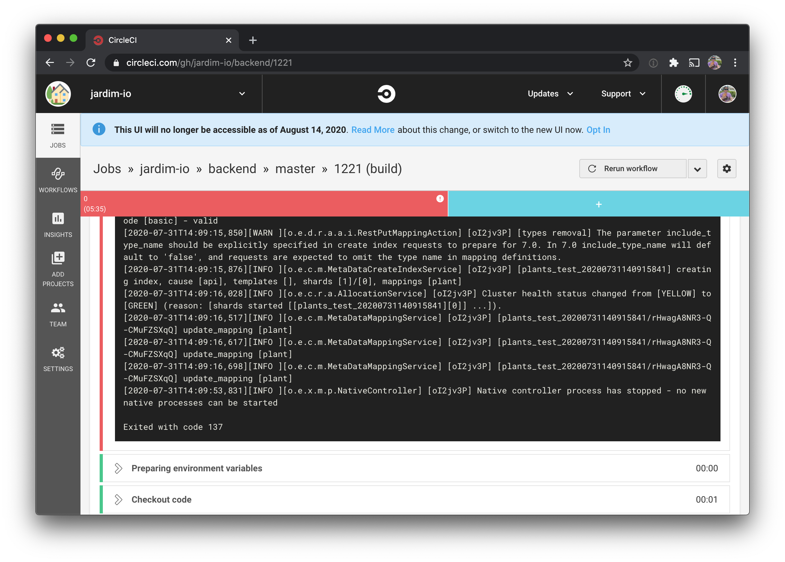

I recently encountered the error "Exited with code 137" on CircleCI when using it in conjunction with Elasticsearch:



The config for elasticsearch was set as so:

```bash
- image: docker.elastic.co/elasticsearch/elasticsearch:6.8.6
  environment:
    - cluster.name: elasticsearch
    - transport.host: localhost
    - network.host: 127.0.0.1
    - http.port: 9200
    - discovery.type: single-node
    - xpack.security.enabled: false
```

After some research, I found that I needed to add the following environment option:

```bash
  - ES_JAVA_OPTS: -Xms750m -Xmx750m
```

What does this do? It sets the heap size for the JVM. It defines a minimum and maximum heap size of 750 MB.

So your config would look like this:

```bash
      - image: docker.elastic.co/elasticsearch/elasticsearch:6.8.6
        environment:
          - cluster.name: elasticsearch
          - transport.host: localhost
          - network.host: 127.0.0.1
          - http.port: 9200
          - discovery.type: single-node
          - xpack.security.enabled: false
          - ES_JAVA_OPTS: -Xms750m -Xmx750m
```

## References

* [Exit code 137 - Out of memory](https://support.circleci.com/hc/en-us/articles/115014359648-Exit-code-137-Out-of-memory?utm_medium=SEM&utm_source=gnb&utm_campaign=SEM-gb-DSA-Eng-uscan&utm_content=&utm_term=dynamicSearch-&gclid=Cj0KCQjwgo_5BRDuARIsADDEntQW30r_6HQauoPmQBwPdS7GgtdxDEhav2ZwnITu3loCLulgSauUgoYaAkoxEALw_wcB)
    
* [ElasticSearch Container got Killed](https://discuss.circleci.com/t/elasticsearch-container-got-killed/17654/3)
    
* [Important Elasticsearch configuration - Setting the heap size](https://www.elastic.co/guide/en/elasticsearch/reference/current/heap-size.html)