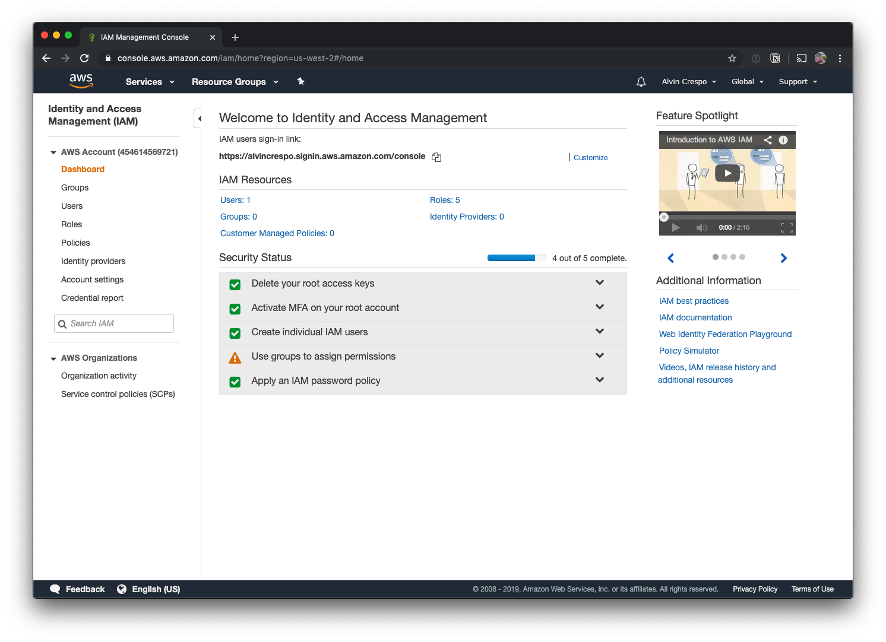
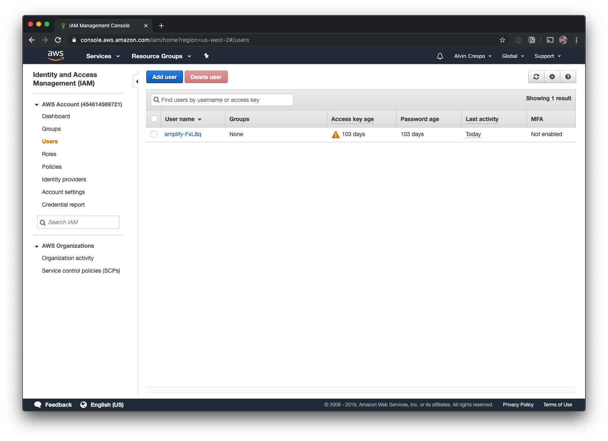
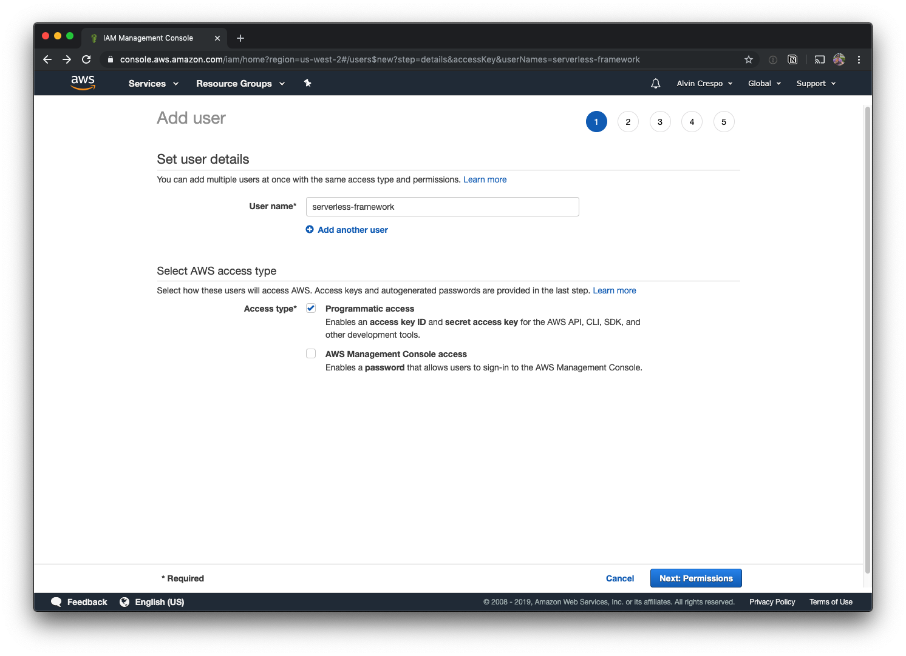
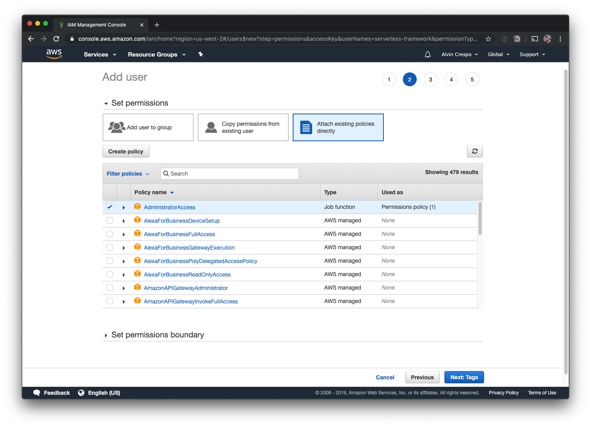
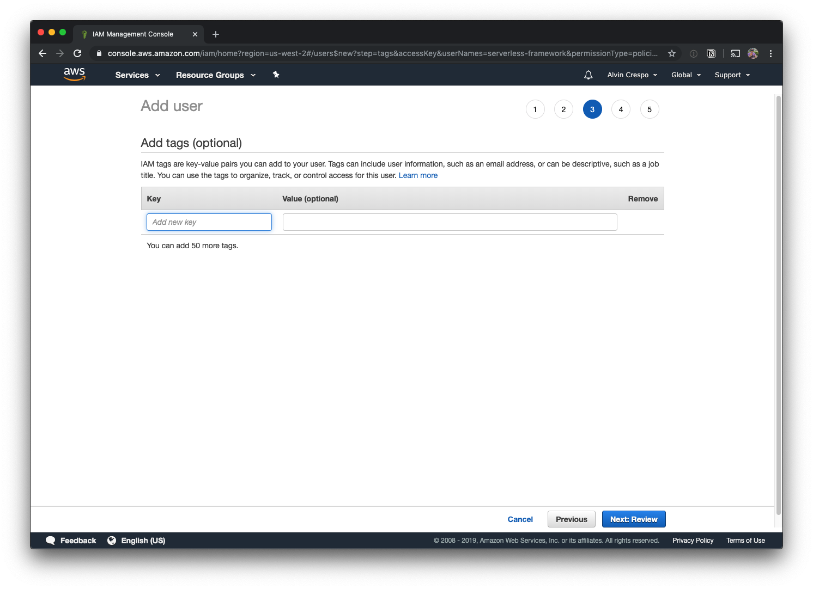
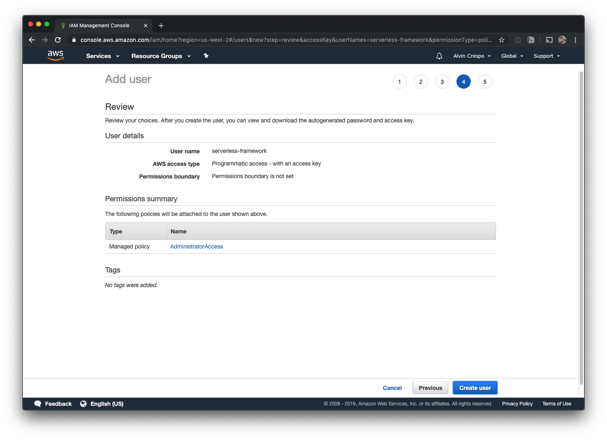
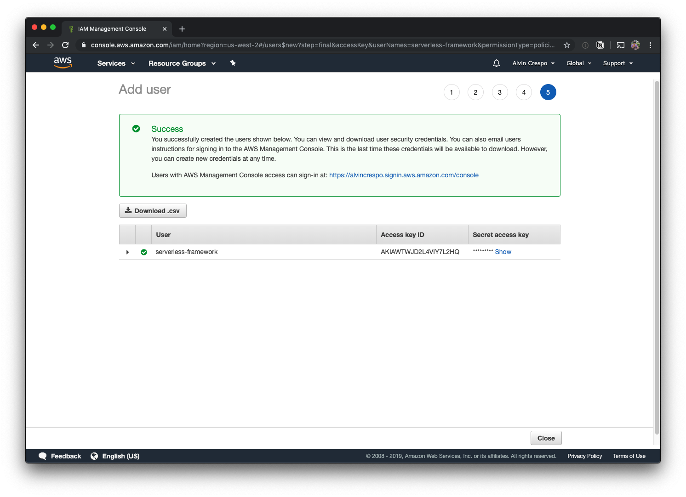
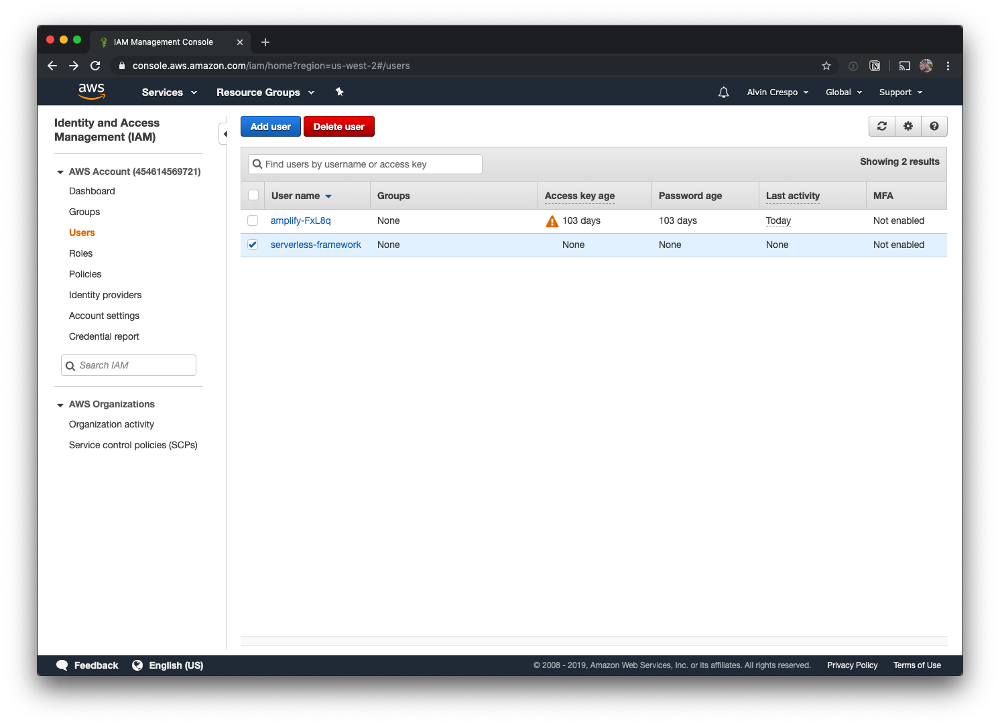

You're probably using Netlify or [Surge.sh](http://surge.sh), probably Heroku. All really amazing options! Heck, I'm using Netlify for my personal site and this blog. But, why do these exist?

Devops is hard and AWS is pretty complicated. Step in, [Serverless Framework](https://serverless.com/) and [Serverless Components](https://github.com/serverless/components)!

In this article, I'm going to help you get going with deploying your frontend application easily with Serverless Framework. At the end of the day, you won't have to depend on a third party service to deploy your apps. 😱😱😱

**Breakdown**

* Set up an IAM user in AWS
    
* Install serverless
    
* Deploy
    

**Prerequisites**

* AWS account
    
* Serverless account (Sign up [here](https://serverlessinc.auth0.com/login?state=g6Fo2SBuZDNwUzdLeGkzSmhiVWZlNVlMQ0M4X0l6V3dSSXAtYqN0aWTZIEpOZzF6QnFMZzhyek1EM3Vfdm1iS3ZkbGhUZ1oxYjlvo2NpZNkgRTRaeHFEOWpPSnNyRWV0VFE2ME8xenpZWE1EaE9lN3c&client=E4ZxqD9jOJsrEetTQ60O1zzYXMDhOe7w&protocol=oauth2&response_type=token%20id_token&scope=openid%20email_verified%20email%20profile%20name&audience=https%3A%2F%2Fserverlessinc.auth0.com%2Fuserinfo&redirect_uri=https%3A%2F%2Fdashboard.serverless.com%2Fcallback&nonce=fc3GCf0HGZLD5YixXZ4jq-MiaX2zHAK1&auth0Client=eyJuYW1lIjoiYXV0aDAuanMiLCJ2ZXJzaW9uIjoiOS4xMS4zIn0%3D))
    

Once you have your AWS and Serverless accounts set up - read ahead.

...

Alright, let's get started!

# Create an IAM User

Ok, so we're going to start by creating a user in AWS. Why? We'll, we definitely don't want third party resources to have access as our root user. So let's hit up the IAM service on AWS:



Once we're on our "Users" page, we're going to click "Add user"



Ok, so first we're going to name the user "serverless-framework" - we've named it this in order to identify it easily.

Then, give this user "Programmatic access"

When you're done, click "Next: Permissions"



Ok, now it's time to assign permissions. I'm going to allow "AdministratorAccess". Behind the scenes the serverless framework uses many AWS services - so narrowing it down could theoretically be difficult.

However, if you're interested in trying it out, the main services the website component utilizes are:

* S3
    
* Certificate Manager
    
* Cloudfront
    
* Route53
    

Once you're done here, click on "Next: Tags"



This step is completely optional, for now - click on "Next: Review".



At this step, you'll review your users details and click "Create user" when you've confirmed everything looks good.



Your use has now been created! At this step, note down your access key id and secret access key.



When you click "Close", you'll be taken to your users page - where your newly created user will be selected.



# Install and Setup Serverless

Verify you have serverless framework installed:

```bash
serverless -v
Framework Core: 1.57.0
Plugin: 3.2.3
SDK: 2.2.1
Components Core: 1.1.2
Components CLI: 1.4.0
```

Note: Make sure you're using serverless framework version 1.49.0 or later.

If you don't have it installed, install it:

```bash
yarn global add serverless
```

or, alternatively:

```bash
npm i -g serverless
```

# Create website from template

```bash
serverless create --template-url https://github.com/serverless/components/tree/master/templates/website
```

This will output:

```bash
Serverless: Generating boilerplate...
Serverless: Downloading and installing "website"...
Serverless: Successfully installed "website"
```

Now, `cd` into the website template directory:

```bash
cd website
```

Now, install dependencies:

```bash
yarn
```

You'll see output like this:

```bash
yarn install v1.19.1
info No lockfile found.
[1/4] 🔍  Resolving packages...
warning parcel-bundler > @parcel/watcher > chokidar > fsevents@1.2.9: One of your dependencies needs to upgrade to fsevents v2: 1) Proper nodejs v10+ support 2) No more fetching binaries from AWS, smaller package size
[2/4] 🚚  Fetching packages...
[3/4] 🔗  Linking dependencies...
[4/4] 🔨  Building fresh packages...
success Saved lockfile.
✨  Done in 12.96s.
```

Now, let's create a `.env` file:

```bash
touch .env
```

Add the aws access key id and secret access key that was created for the serverless-framework user:

```bash
AWS_ACCESS_KEY_ID=abc123
AWS_SECRET_ACCESS_KEY=456xyz
```

Replace the values `abc123` and `456xyz` respectively.

You should now be able to run the application locally:

```bash
yarn start
```

When the build is done, you should be able to hit [http://localhost:1234/](http://localhost:1234/)

# Deploying your app

Let's open up `serverless.yml`

Now, let's update the deploy hook to run `yarn build`

```yaml
name: website

website:
  component: '@serverless/website'
  inputs:
    code:
      src: dist
      hook: yarn build
```

Now, all you need to do is run:

```bash
serverless
```

The output will be:

```bash
➜   serverless

  website:
    url: http://8k2k8q-qbwj2nm.s3-website-us-east-1.amazonaws.com
    env:

  16s › website › done
```

Now you can visit the URL generated and check out your live site. 💥💥💥

---

Sweet! We got a frontend application deployed using Serverless Framework's website component!

Hope you enjoyed this article and huge thanks to the team at Serverless for making our lives better. This is the kind of productivity gains I can live with.

Until next time! 👋

---

## References

Oh! Want to know how I learned all this? Well - the serverless team has an amazing [YouTube channel](https://www.youtube.com/channel/UCFYG383lawh9Hrs_DEKTtdg) with tons of resources on learning how to go serverless.

Check out the below video for more information around getting up and going:

<iframe width="560" height="315" src="https://www.youtube.com/embed/ts26BVuX3j0"></iframe>

\`\`\`