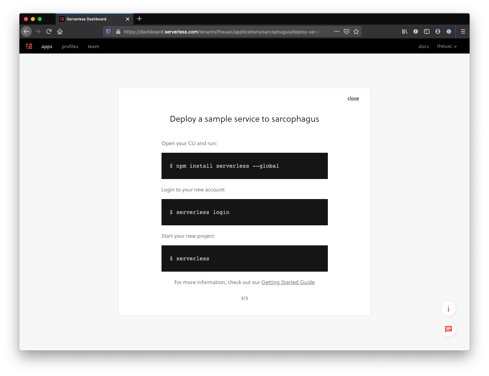
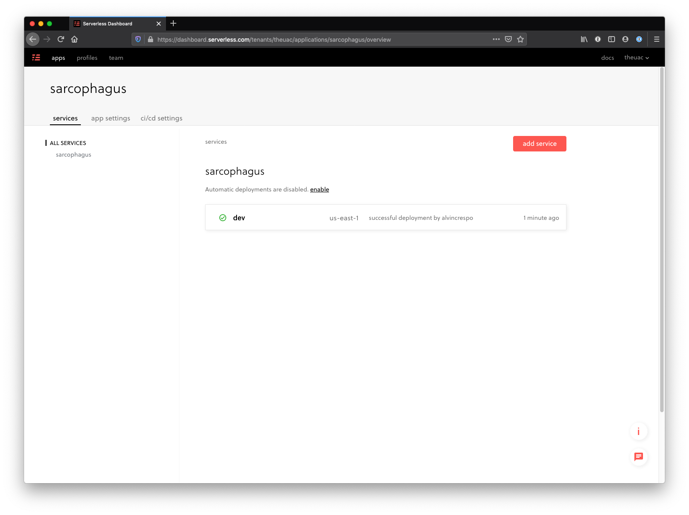
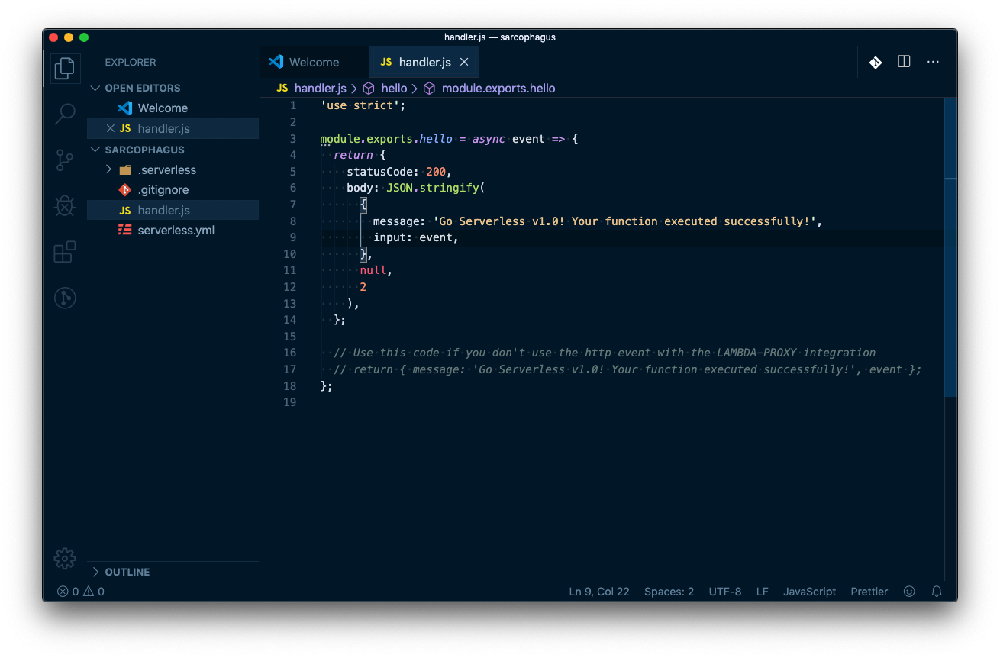

I'm taking some time to learn the [Serverless Framework](https://serverless.com/) this weekend, and thought I'd share my first learning - how to get started.

First, let me start with the fact that they have a quick [getting started](https://serverless.com/framework/docs/getting-started/) guide. If
you're signing up for the first time - they also have a pretty smooth onboarding flow to create your first app.

The part that I got stuck on was verifying anything was really working, and breaking down what's happening.

So, let's get started.

## Install NodeJS

The first thing you'll want to do is get [NodeJS](https://nodejs.org/en/) installed. I typically use [nvm](https://github.com/nvm-sh/nvm) because I have multiple node versions running.

```shell
curl -o- https://raw.githubusercontent.com/nvm-sh/nvm/v0.35.1/install.sh | bash
```

Next, I'll install the specific NodeJS version with nvm. For this article, I'm using the latest LTS version: 12.13.0

```shell
nvm install 12.13.0
```

## Install yarn (optional)

Yeah, I would use npm - but I'm so used to [yarn](https://yarnpkg.com/lang/en/) now that it's basically my default:

```shell
npm install -g yarn
```

## Install Serverless

Now we need to install serverless globally:

```shell
yarn global add serverless
```

Or, if you are using npm:

```shell
npm install -g serverless
```

## Login into Serverless

Alright, so you'll need to have an account - so sign up [here](https://serverlessinc.auth0.com/login?state=g6Fo2SBoYndZZFkxRXQzejNZV3ExWFM5aTZaUkpERHk5c2tvb6N0aWTZIDdSTGp2VXp4OVJSY0hHZkdUWkVrUjRMOGFiMHBDM3M2o2NpZNkgRTRaeHFEOWpPSnNyRWV0VFE2ME8xenpZWE1EaE9lN3c&client=E4ZxqD9jOJsrEetTQ60O1zzYXMDhOe7w&protocol=oauth2&response_type=token%20id_token&scope=openid%20email_verified%20email%20profile%20name&audience=https%3A%2F%2Fserverlessinc.auth0.com%2Fuserinfo&redirect_uri=https%3A%2F%2Fdashboard.serverless.com%2Fcallback&nonce=_ON3KK5NzXLmNykAMIBcePbnND9ONxZV&auth0Client=eyJuYW1lIjoiYXV0aDAuanMiLCJ2ZXJzaW9uIjoiOS4xMS4zIn0%3D).

Once you have an account set up, you'll be taken through their onboarding flow, where you'll eventually land on:



Let's stop there. Switch back to your terminal and login into our account:

```shell
serverless login
```

This will generate a link that you'll copy/paste in order to verify your account.

## Setting our app locally

Now that we're logged in, we need to set up the app locally.

In my case, I've created an org called `theuac` and an app called `sarcophagus` - yes, a [DOOM](<https://en.wikipedia.org/wiki/Doom_(2016_video_game)>) reference.

Anyways, if we just type in:

```shell
serverless
```

We'll be creating a new app. Instead, we want to type in:

```shell
$ serverless --org [ORG] --app [APP]
```

Where, in my case, `[ORG]` is `theuac` and `[APP]` is `sarcophagus`:

```shell
$ serverless --org theuac --app sacophagus
```

You'll see the following output:

```shell
➜  serverless --org theuac --app sarcophagus

Serverless: No project detected. Do you want to create a new one? Yes
Serverless: What do you want to make? AWS Node.js
Serverless: What do you want to call this project? sarcophagus

Project successfully created in 'sarcophagus' folder.


Your project is setup for monitoring, troubleshooting and testing

Deploy your project and monitor, troubleshoot and test it:
- Run “serverless deploy” to deploy your service.
- Run “serverless dashboard” to view the dashboard.
```

This will set up the app locally and you'll just need to cd into it:

```shell
cd sarcophagus
```

Note: Replace `sarcophagus` with your apps name.

## Deploying the app

Easy.

```shell
serverless deploy
```

A successful deploy will look like this:

```shell
➜  serverless deploy
Serverless: Packaging service...
Serverless: Excluding development dependencies...
Serverless: Safeguards Processing...
Serverless: Safeguards Results:

   Summary --------------------------------------------------

   passed - allowed-stages
   passed - allowed-runtimes
   passed - framework-version
   passed - allowed-regions
   warned - require-cfn-role
   passed - no-secret-env-vars
   passed - no-unsafe-wildcard-iam-permissions

   Details --------------------------------------------------

   1) Warned - no cfnRole set
      details: http://slss.io/sg-require-cfn-role
      Require the cfnRole option, which specifies a particular role for CloudFormation to assume while deploying.


Serverless: Safeguards Summary: 6 passed, 1 warnings, 0 errors
Serverless: Creating Stack...
Serverless: Checking Stack create progress...
........
Serverless: Stack create finished...
Serverless: Uploading CloudFormation file to S3...
Serverless: Uploading artifacts...
Serverless: Uploading service sarcophagus.zip file to S3 (68.32 KB)...
Serverless: Validating template...
Serverless: Updating Stack...
Serverless: Checking Stack update progress...
........................
Serverless: Stack update finished...
Service Information
service: sarcophagus
stage: dev
region: us-east-1
stack: sarcophagus-dev
resources: 8
api keys:
  None
endpoints:
  None
functions:
  hello: sarcophagus-dev-hello
layers:
  None
Serverless: Publishing service to the Serverless Dashboard...
Serverless: Successfully published your service to the Serverless Dashboard: https://dashboard.serverless.com/tenants/theuac/applications/sarcophagus/services/sarcophagus/stage/dev/region/us-east-1

```

Cool! If we visit the dashboard, we'll see:



## Testing our Endpoint

Ok, so we have an app and it's magically running. How do we verify this?

We just need to run the following:

```shell
serverless invoke --function hello
```

Which gives us this output:

```shell
➜  serverless invoke --function hello
{
    "statusCode": 200,
    "body": "{\n  \"message\": \"Go Serverless v1.0! Your function executed successfully!\",\n  \"input\": {}\n}"
}
```

If we want a detailed log, we can just add the `--log` flag:

```shell
➜  serverless invoke --function hello --log
{
    "statusCode": 200,
    "body": "{\n  \"message\": \"Go Serverless v1.0! Your function executed successfully!\",\n  \"input\": {}\n}"
}
--------------------------------------------------------------------
START RequestId: 295f88a1-bf6e-45f8-9399-ab1c014f68d1 Version: $LATEST
2019-11-16 11:39:25.185 (-05:00)        295f88a1-bf6e-45f8-9399-ab1c014f68d1    INFO    SERVERLESS_ENTERPRISE {"origin":"sls-agent","schemaVersion":"0.0","timestamp":"2019-11-16T16:39:25.176Z","requestId":"295f88a1-bf6e-45f8-9399-ab1c014f68d1","type":"transaction","payload":{"schemaType":"s-span","schemaVersion":"0.0","operationName":"s-transaction-function","startTime":"2019-11-16T16:39:25.168Z","endTime":"2019-11-16T16:39:25.176Z","duration":6.626856,"spanContext":{"traceId":"295f88a1-bf6e-45f8-9399-ab1c014f68d1","spanId":"b8ca5d2d-0327-4af3-87f3-fcd7df657dba","xTraceId":"Root=1-5dd0263c-a0524d66c2a6d0ef00ff2269;Parent=4aabe638022ea961;Sampled=0"},"tags":{"schemaType":"s-transaction-function","schemaVersion":"0.0","timestamp":"2019-11-16T16:39:25.168Z","tenantId":"theuac","applicationName":"sarcophagus","serviceName":"sarcophagus","stageName":"dev","functionName":"sarcophagus-dev-hello","timeout":6,"computeType":"aws.lambda","computeRuntime":"aws.lambda.nodejs.10.17.0","computeRegion":"us-east-1","computeMemorySize":"1024","computeMemoryUsed":"{\"rss\":43458560,\"heapTotal\":19161088,\"heapUsed\":9191464,\"external\":16888}","computeMemoryPercentageUsed":0.87890625,"computeContainerUptime":0.191,"computeIsColdStart":true,"computeInstanceInvocationCount":1,"computeCustomSchemaType":"s-compute-aws-lambda","computeCustomSchemaVersion":"0.0","computeCustomFunctionName":"sarcophagus-dev-hello","computeCustomFunctionVersion":"$LATEST","computeCustomArn":"arn:aws:lambda:us-east-1:454614569721:function:sarcophagus-dev-hello","computeCustomRegion":"us-east-1","computeCustomMemorySize":"1024","computeCustomInvokeId":null,"computeCustomAwsRequestId":"295f88a1-bf6e-45f8-9399-ab1c014f68d1","computeCustomXTraceId":"Root=1-5dd0263c-a0524d66c2a6d0ef00ff2269;Parent=4aabe638022ea961;Sampled=0","computeCustomLogGroupName":"/aws/lambda/sarcophagus-dev-hello","computeCustomLogStreamName":"2019/11/16/[$LATEST]bbf2508c31024c9a85399dcdc29b94bf","computeCustomEnvPlatform":"linux","computeCustomEnvArch":"x64","computeCustomEnvMemoryTotal":1219440640,"computeCustomEnvMemoryFree":1060286464,"computeCustomEnvCpus":"[{\"model\":\"Intel(R) Xeon(R) Processor @ 2.50GHz\",\"speed\":2500,\"times\":{\"user\":1400,\"nice\":0,\"sys\":3800,\"idle\":39317800,\"irq\":0}},{\"model\":\"Intel(R) Xeon(R) Processor @ 2.50GHz\",\"speed\":2500,\"times\":{\"user\":3200,\"nice\":0,\"sys\":5200,\"idle\":39316000,\"irq\":0}}]","eventType":"unknown","eventTimestamp":"2019-11-16T16:39:25.169Z","eventSource":null,"eventCustomStage":"dev","errorId":null,"errorFatal":null,"errorCulprit":null,"errorExceptionType":null,"errorExceptionMessage":null,"errorExceptionStacktrace":null,"transactionId":"b8ca5d2d-0327-4af3-87f3-fcd7df657dba","appUid":"lCMhKVT4wTR2Fz9chS","tenantUid":"QKrC5p18XtR3RCmwjm","pluginVersion":"3.2.3","totalSpans":0,"traceId":"295f88a1-bf6e-45f8-9399-ab1c014f68d1"},"logs":{},"spans":[],"eventTags":[]}}
END RequestId: 295f88a1-bf6e-45f8-9399-ab1c014f68d1
REPORT RequestId: 295f88a1-bf6e-45f8-9399-ab1c014f68d1  Duration: 24.43 ms      Billed Duration: 100 ms Memory Size: 1024 MB    Max Memory Used: 84 MB  Init Duration: 209.18 ms

```

## How did I know what function to run?

If we look at the project that was set up for us, we'll find a `handler.js` file:



The file exports a module called `hello` returns an object with `statusCode` and a JSON stringified `body`.

<hr>

Alright, that's all for now! Thanks for reading my article on getting started with the serverless framework. I'm excited to use this tech and see how we can easily transform our tech stack to not only scale quickly in the cloud but help us architect smaller pieces of functionality that makes building software enjoyable!

Until next time! 👋
