Want to ship landing pages easily? Cool. Let's do it.

Today, I'm going to show you how to use [DatoCMS](https://www.datocms.com/) to manage your content and [Gatsby.js](https://www.gatsbyjs.org/) to run it.

# Prerequisites

Here's what you need to be familiar with:

* [JavaScript](https://javascript.info/) (obviously)
    
* [CMS Concepts](https://blog.hubspot.com/blog/tabid/6307/bid/7969/what-is-a-cms-and-why-should-you-care.aspx)
    
* [Gatsby.js](https://www.gatsbyjs.org/docs/)
    
* [React](https://reactjs.org/)
    
* [GraphQL](https://graphql.org/)
    
* [JAMStack](https://jamstack.wtf/)
    

You just need to know what these things are. You don't need to be an expert.

# Getting Started

A couple of things you need to do:

* [Sign up](https://dashboard.datocms.com/signup) for DatoCMS
    
* Setup a Gatsby.js site, follow the quick start guide [here](https://www.gatsbyjs.org/docs/quick-start/)
    

Once, you've got an account and set up your Gatsby site - go to the next section.

# The Story

Alright, so let's start with the value proposition for why and what we're building:

> My name is Juan. I'm on the market for my next engineering role. I want to stand out in the process, instead of sending out a cover letter I'm going to create a landing page and send that with each job application.

Cool. So, we have a bunch of options out there. We can use Wix, Wordpress, etc... But - nah. We're going to use Gatsby + DatoCMS. Why?

* Cost effective (free packages on all services)
    
* Easy customization (more control over the code)
    
* Fast delivery (low learning barrier - we're going JAMStack baby!)
    

# Defining the Data Model

If you're not familiar with data modeling, I highly recommend checking out [Data Modeling: Ensuring Data You Can Trust](https://www.talend.com/resources/what-is-data-modeling/). It boils down to this:

> An effective data modelling procedure leads to better allocation of human and computational resources, anticipates issues before they arise, bolsters cross-functional communication, and enforces compliance (regulatory and internal) — all while guaranteeing underlying data quality, security, and accessibility.

We're not going to build out anything complicated, but I think this is important in general, so leaving the above in as informational material for you.

Alright - data model time. Here's the data model we're working with:

* **CoverLetter**
    
    * Attributes
        
        * Company Name (string)
            
        * Job Title (string)
            
        * Slug (string)
            
        * Introduction (text / html)
            
    * Relationships
        
        * has many **Skill**s
            
        * has many **Frequently Asked Question**s
            
* **Frequently Asked Question**
    
    * Attributes
        
        * Question (string)
            
        * Answer (string)
            
* **Icon**
    
    * Attributes
        
        * Name (string)
            
        * SVG (text / html)
            
* **Skill**
    
    * Attributes
        
        * Name (string)
            
        * Description (text / html)
            
    * Relationships
        
        * has one **Icon**
            

# DatoCMS - Setting up Models

So we have our data model, let's start setting these up in DatoCMS. We're going to navigate to "Settings" in the top nav and click on "Models" in the sidebar.

To move a bit faster, I'm dropping screenshots below of what these models should look like. Feel free to complete this on your end. For more information around how text fields can be displayed within DatoCMS itself and defining relationships - read the next two sections and then come back here to finish this section up.

## Cover Letter

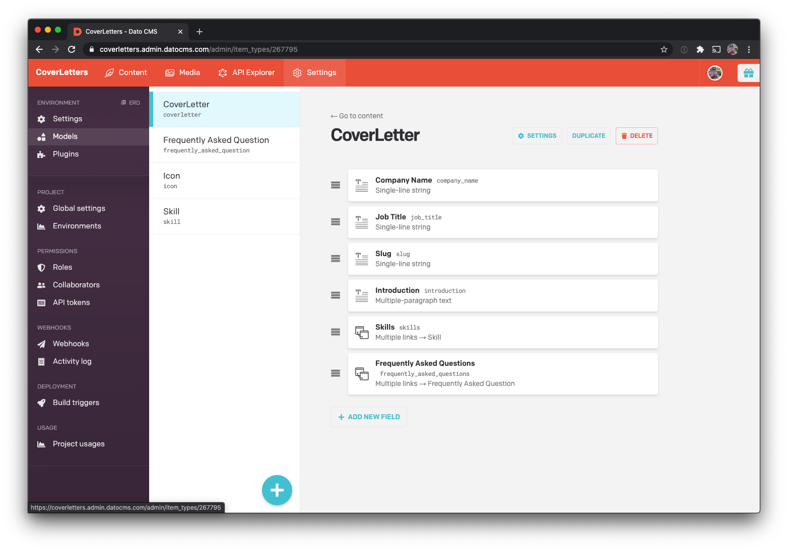

## Frequently Asked Question

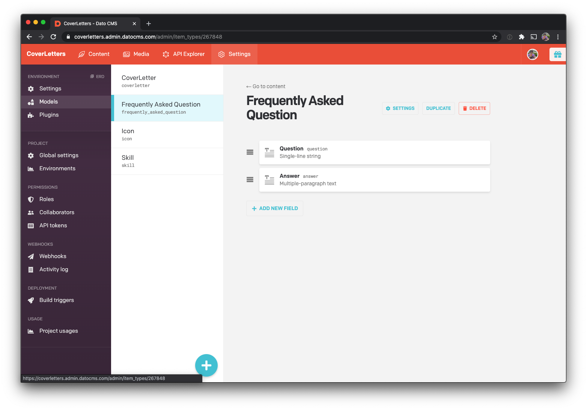

## Icon

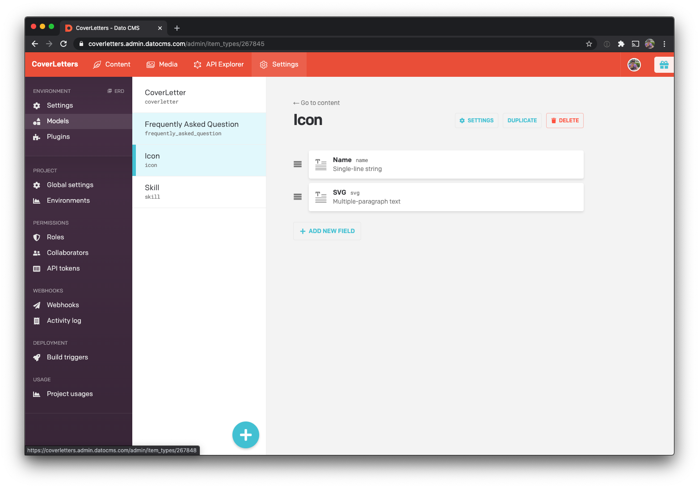

## Skill

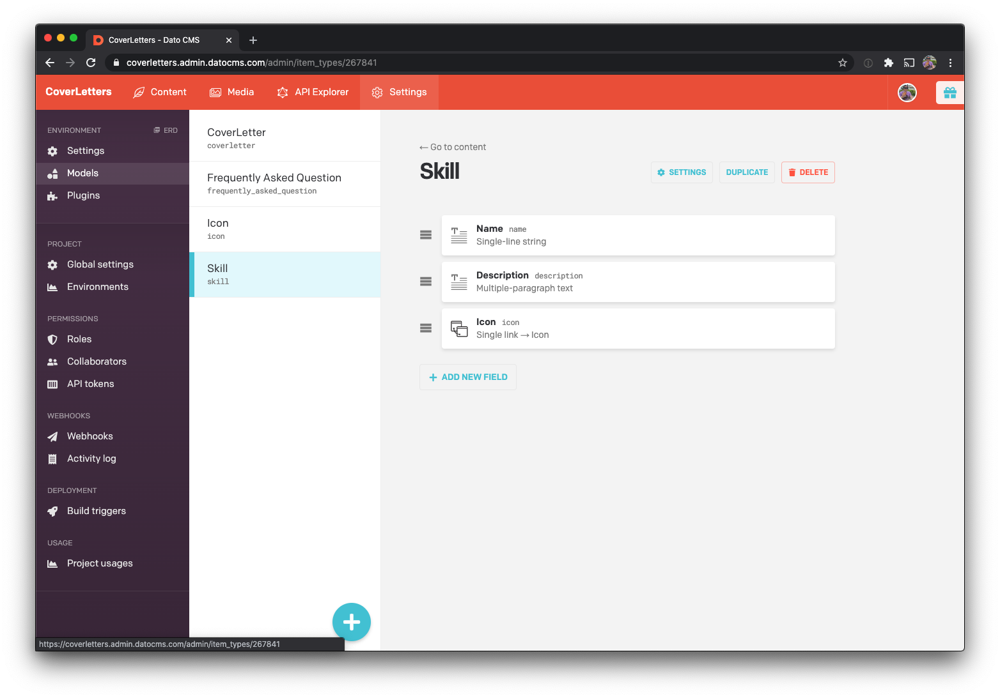

# DatoCMS - Text Field Presentations

When you select the "Multiple-paragraph text" option as a field type, you have the ability to customize how that field looks like within DatoCMS's Content area. For example, if we go ahead and edit a "Multiple-paragraph text" field type and hit the "Presentation" tab - we have tha bility to select an HTML Editor:

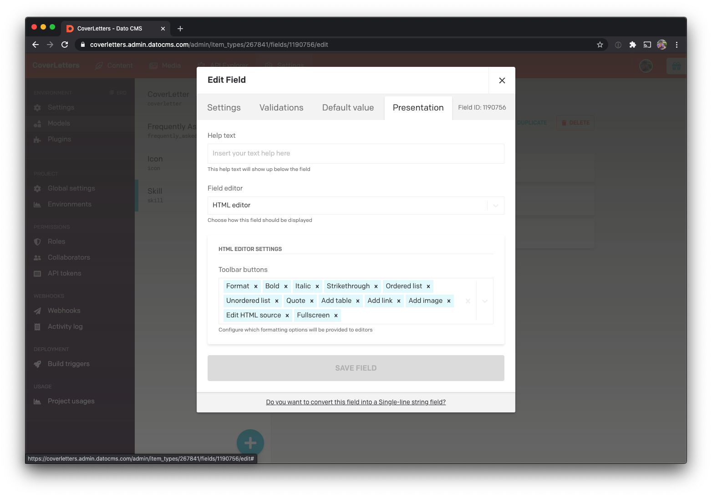

If we do that, we then see:

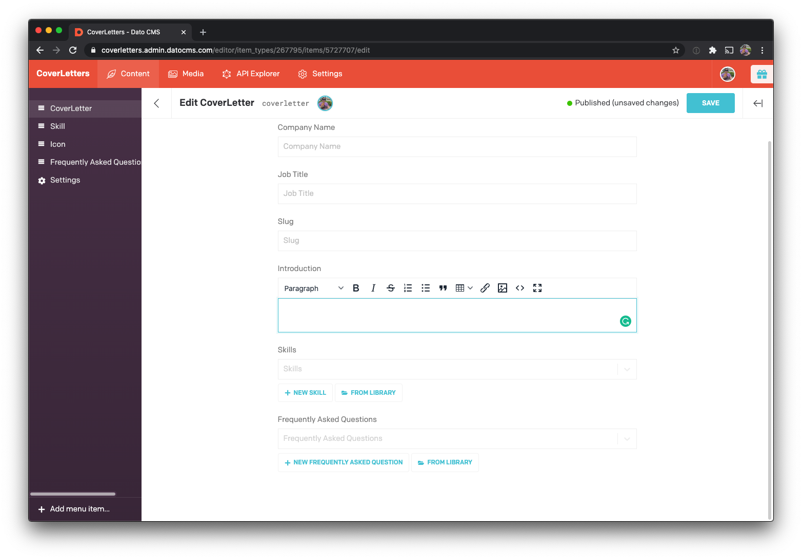

This will enable us to essentially add markup in DatoCMS - and then render it within our Gatsby app. So for this tutorial, select "HTML Editor" so we can get some CMS driven content into our app later.

# DatoCMS - Defining Relationships

In DatoCMS - relationships are defined as "links".

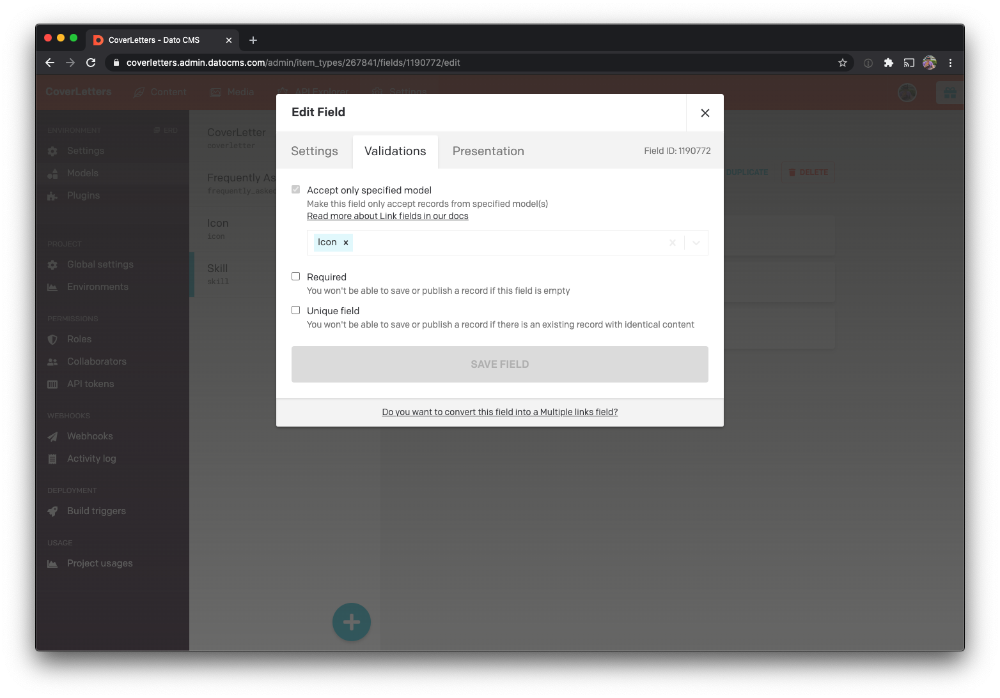

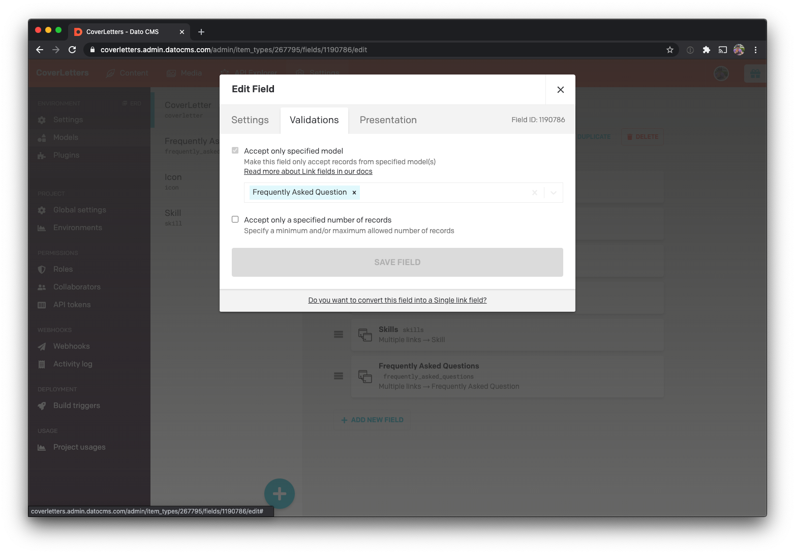


By defining these relationships, when we go to create the content, we'll be able to select the instances that we create:

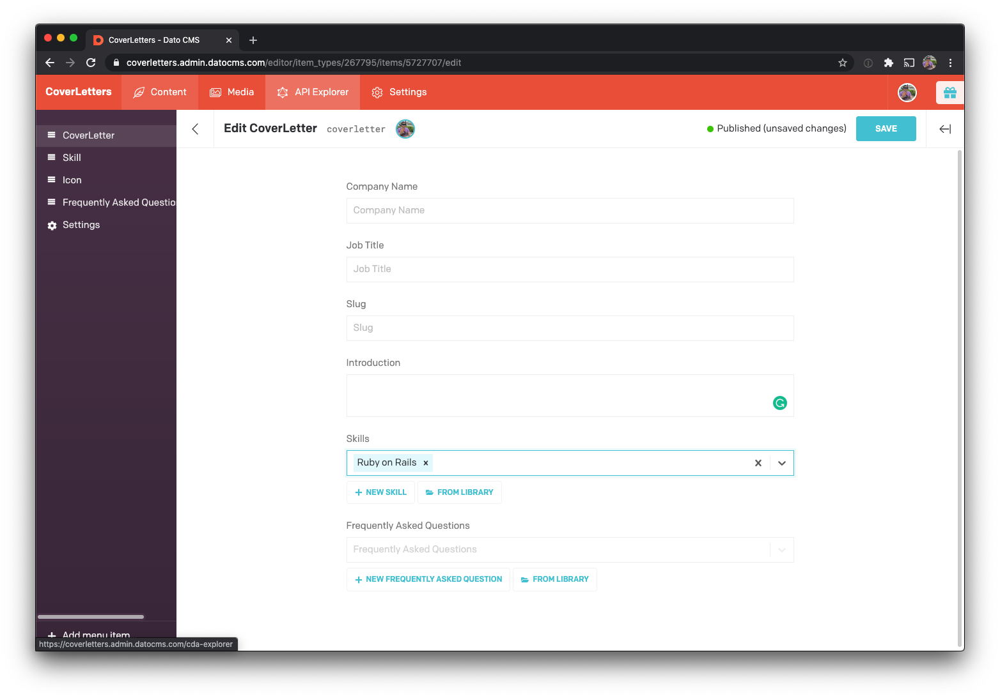

In the above example, I've created a "Ruby on Rails" skill - and have associated it with this new cover letter. Nifty, eh?!

Just keep in mind that you'll need to define each model first. Then you'll need to come back and add the links - since the model definition needs to exist for you to select it 😉.

# Gatsby.js - Installing and Configuring Dependencies

If you followed the "Getting Started" section of this article - you should have a gatsby site ready.

The first step in connecting DatoCMS is installing `gatsby-source-datocms`, you can do this by running:

```bash
npm i --save gatsby-source-datocms
```

or

```bash
yarn add gatsby-source-datocms
```

Either way, you want to have the dependency listed in the `dependencies` section of your `package.json`:

```bash
    "gatsby-source-datocms": "^2.3.0",
```

Note: This was the version being installed at the time of this article.

Once the dependency is installed, let's use and configure it. To do that, let's hit up `gatsby-config.js` and add the following to the plugins list:

```bash
    // more plugins above
    {
      resolve: `gatsby-source-datocms`,
      options: {
        apiToken: process.env.CMS_TOKEN,
        preview: false,
        disableLiveReload: false,
      },
    },
```

Note: I've added this at the bottom of my plugins list.

Alright. So if you notice above - we have the following code: `apiToken: process.env.CMS_TOKEN`. You need an API token in order to query your data.

I'm using the read only version of the api token, since all I'm doing is presenting data - not modifying it. To get your API token, go to DatoCMS. Hit the "Settings" nav link at the top and then click on "API tokens" under the "Permissions" section of the sidebar. Click on "Read-only API token" and copy that sucker.

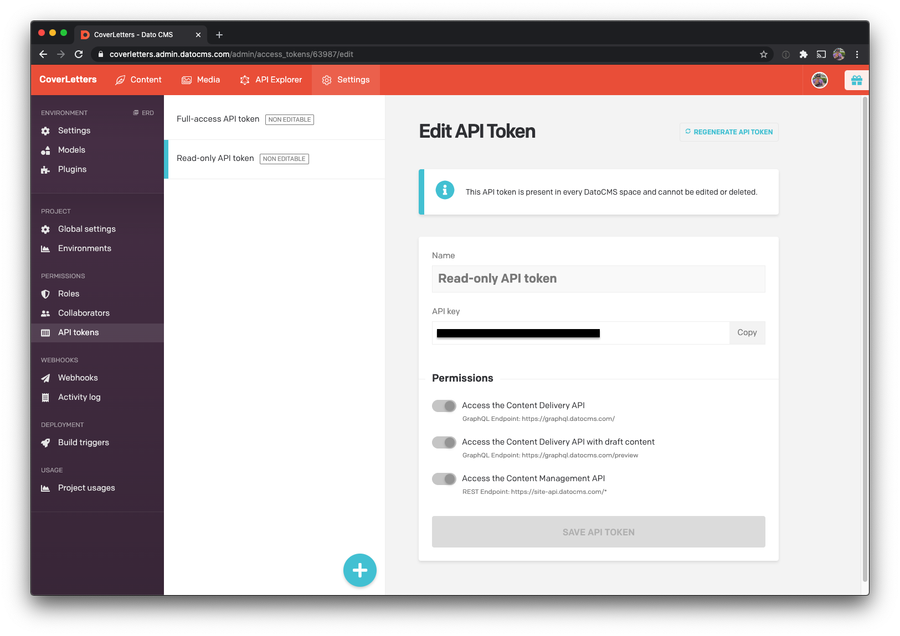

Now, you can use a package like [dotenv](https://github.com/motdotla/dotenv) or whatever to load in environment variables - but I'm NOT going to get into that for this article.

I'm simply going to have you run:

```bash
CMS_TOKEN=MY_API_TOKEN yarn develop
```

Note: Update `MY_API_TOKEN` with the token you copied earlier.

You won't notice any changes yet because we haven't really done anything user facing yet. Let's push forward!

# Gatsby.js - Exploring the Playground

Let's take a moment to understand how we can interact with DatoCMS's api using GraphQL. The best part about using Gatsby.js is that you get GraphQL for free and in order to start experimenting with it - you just need to use the built-in playground.

So, let's run the app:

```bash
CMS_TOKEN=MY_API_TOKEN yarn develop
```

Note: Update `MY_API_TOKEN` with the token you copied earlier.

Once that app is running, you can visit [http://localhost:8000/\_\_graphql](http://localhost:8000/__graphql)

You should see:

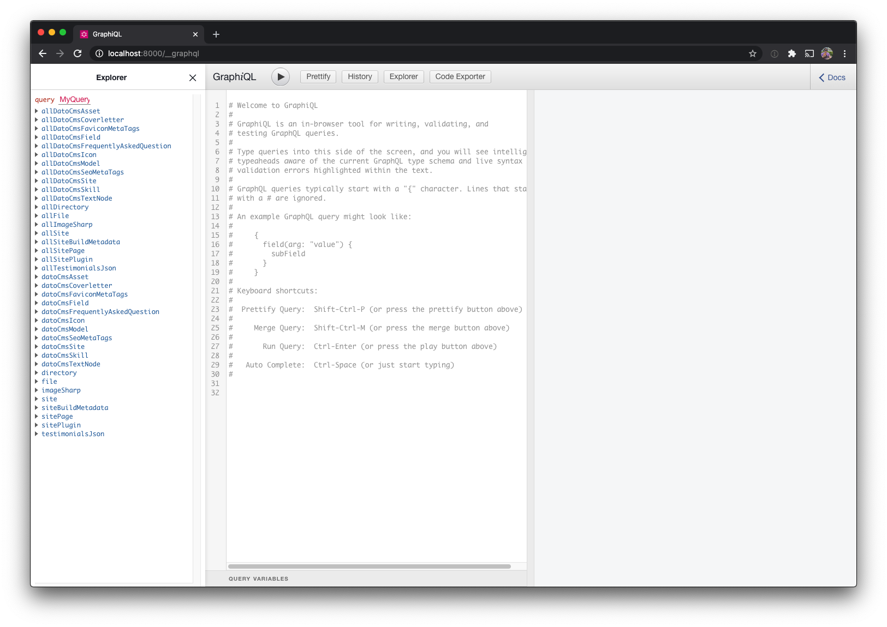

In the playground you can experiment with all the queries available to you, including this one:

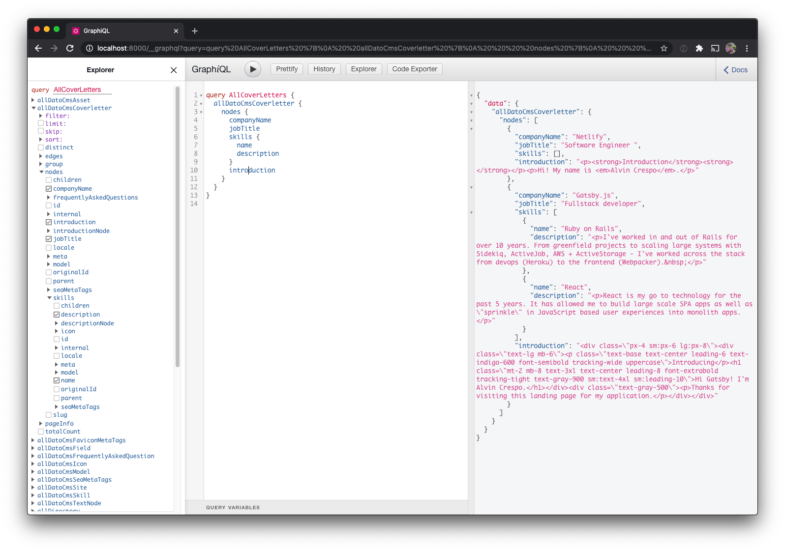

The above query fetches all our cover letters.

You can also fetch per the slug field we defined earlier:

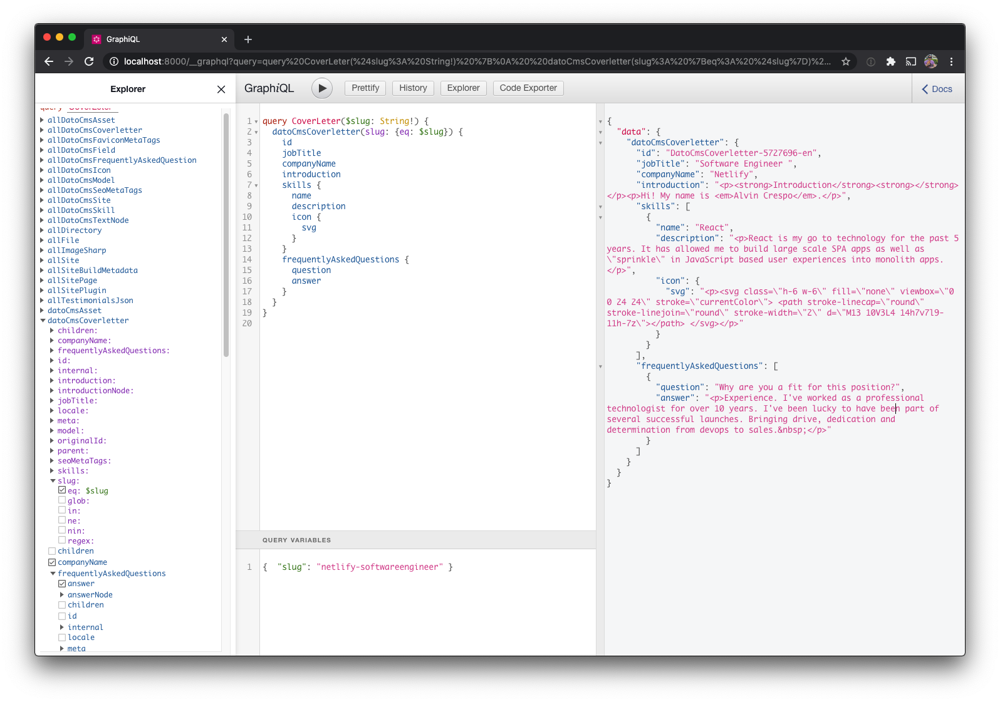

Cool right?! Yeah..very cool!

## Break Time!

This is a good time to take a break. If you haven't already, put in some content into DatoCMS!

# DatoCMS + Gatsby.js - The Perfect Match

Alright. So we installed and configured DatoCMS + Gatsby.js. We added some content to DatoCMS. Now we're ready to connect the dots.

## Gatsby.js - Creating Dynamic Pages

Firs things first. We need to retrieve the content from DatoCMS and create landing pages. This requires us to tap into Gatsby.js' API. Specifically, we'll need to use the [`createPages`](https://www.gatsbyjs.org/docs/node-apis/#createPages) function.

So let's go to `gatsby-node.js` and drop in the following snippet:

```javascript
const path = require(`path`)

exports.createPages = ({ graphql, actions }) => {
  const { createPage } = actions

  return new Promise((resolve) => {
    graphql('
      {
        allDatoCmsCoverletter {
          edges {
            node {
              slug
            }
          }
        }
      }
    ').then((result) => {
      result.data.allDatoCmsCoverletter.edges.map(({ node: coverletter }) => {
        createPage({
          path: `applications/${coverletter.slug}`,
          component: path.resolve(`./src/templates/coverletter-page.js`),
          context: {
            slug: coverletter.slug,
          },
        })
      })
      resolve()
    })
  })
}
```

Credit: [DatoCMS - Gatsby Portfolio Example](https://github.com/datocms/gatsby-portfolio/blob/master/src/templates/work.js)

So, what does this do?

* It uses the `allDatoCmsCoverletter` query (from `gatsby-source-datocms`) to retrieve all our data
    
* Once we get the results, we use `createPage` to set a path, define the component to use (which we have not defined yet) and provide the context/slug for that page
    

Essentially, this allows us to visit `http://localhost:8000/applications/COVERLETTER_SLUG` - where `COVERLETTER_SLUG` is the slug field value for a CoverLetter instance in DatoCMS.

TL;DR - It brings in the content from a model instance like this one:

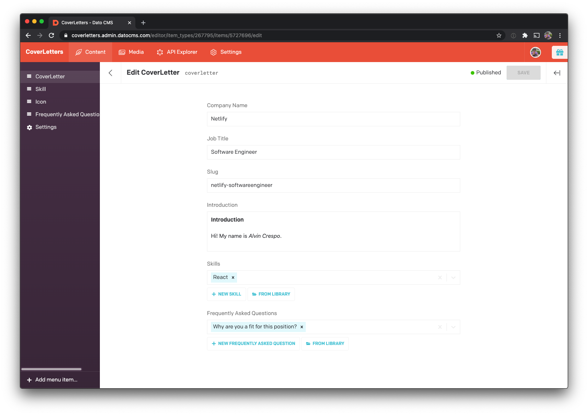

## Gatsby.js - Defining the template

So we're dynamically creating pages from content defined in DatoCMS - great! Now we need to define the template above so we can render that content.

First, create a directory called `templates` inside of `src`. Then, add the file `coverletter-page.js` inside of `templates`.

For confirmation, you should have the following file: `src/templates/coverletter-page.js`.

This is the file that will render the content from DatoCMS. So you can style it anyway you want. We're going to keep it simple:



```jsx
import React from "react"
import { graphql } from "gatsby"
import Layout from "../components/layout"

const CoverLetter = ({ data }) => {
  return (
    <Layout>
      <div className="my-6">
        <section className="mb-6">
          <h2 className="text-5xl tracking-tight leading-none uppercase text-center">
            {data.datoCmsCoverletter.companyName} //{" "}
            {data.datoCmsCoverletter.jobTitle}
          </h2>
        </section>

        {/* SECTION: Introduction  */}
        <div
          dangerouslySetInnerHTML={{
            __html: data.datoCmsCoverletter.introduction,
          }}
        />

        {/* SECTION: Skills */}
        <div className="my-10 px-4">
          <h3 className="text-base uppercase">My Skills</h3>
          <div className="mt-10">
            <ul className="grid grid-cols-2 col-gap-8 row-gap-10">
              {data.datoCmsCoverletter.skills.map((s) => (
                <li>
                  <div className="flex">
                    <div className="flex-shrink-0">
                      <div
                        className="flex items-center justify-center h-12 w-12 rounded-md bg-indigo-500 text-white"
                        dangerouslySetInnerHTML={{
                          __html: s.icon.svg,
                        }}
                      ></div>
                    </div>
                    <div className="ml-4">
                      <h4 className="text-lg leading-6 font-medium text-gray-900">
                        {s.name}
                      </h4>
                      <p
                        className="mt-2 text-base leading-6 text-gray-500"
                        dangerouslySetInnerHTML={{
                          __html: s.description,
                        }}
                      />
                    </div>
                  </div>
                </li>
              ))}
            </ul>
          </div>
        </div>

        {/* SECTION: FAQs */}
        <div className="my-10 px-4">
          <h3 className="text-base uppercase">Frequently Asked Questions</h3>
          <div className="mt-10">
            <dl className="grid grid-cols-2 gap-8">
              {data.datoCmsCoverletter.frequentlyAskedQuestions.map((faq) => (
                <div>
                  <dt className="text-lg leading-6 font-medium text-gray-900">
                    {faq.question}
                  </dt>
                  <dd className="mt-2">
                    <p
                      className="text-base leading-6 text-gray-500"
                      dangerouslySetInnerHTML={{
                        __html: faq.answer,
                      }}
                    ></p>
                  </dd>
                </div>
              ))}
            </dl>
          </div>
        </div>
      </div>
    </Layout>
  )
}

export default CoverLetter

export const query = graphql'
  query GetCoverLetter($slug: String!) {
    datoCmsCoverletter(slug: { eq: $slug }) {
      id
      jobTitle
      companyName
      introduction
      skills {
        name
        description
        icon {
          svg
        }
      }
      frequentlyAskedQuestions {
        question
        answer
      }
    }
  }
'
```



Note: We're using `dangerouslySetInnerHTML` in order to render HTML content that we have filled in DatoCMS.

Ok. So if you're ready - I'm ready! Let's restart the app and load up [http://localhost:8000](http://localhost:8000).

You should see something like this:

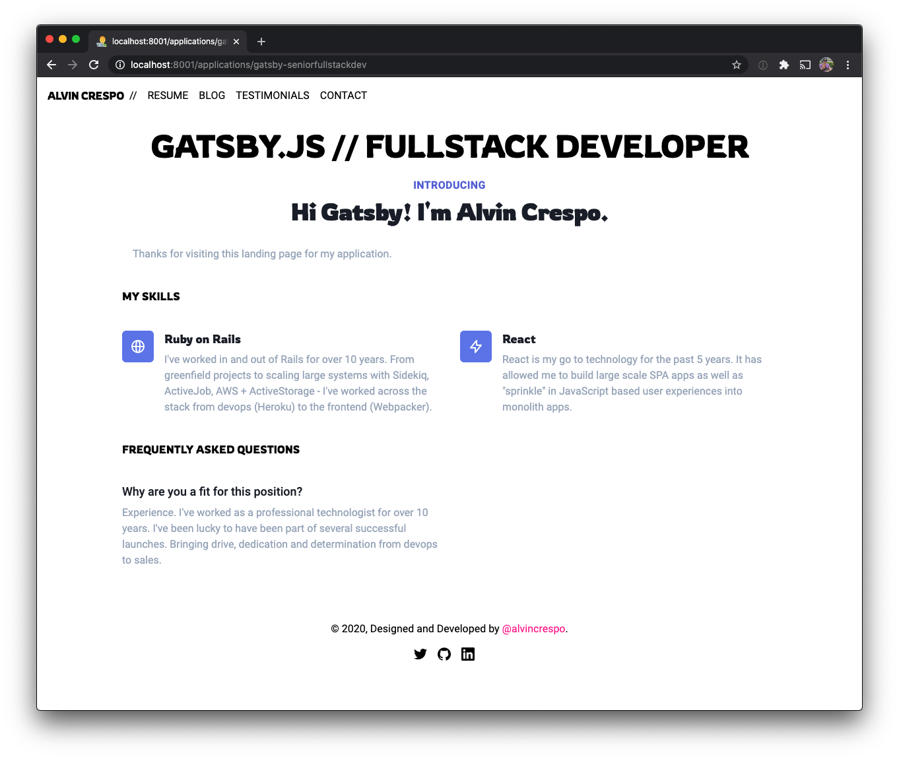

Note: Your design will look totally different. I'm using [Tailwind](https://tailwindcss.com/) + [TailwindUI](https://tailwindui.com/) on my personal site - which is why it looks the way that it does above.

# 🚀 🚀 🚀 Congrats! You've made it! 🚀 🚀 🚀

## What we learned

* Data modeling
    
* DatoCMS' Capabilities
    
* Integrating DatoCMS with Gatsby.js
    
* Gatsby.js API using `createPages` and `createPage`
    
* GraphQL fetching and slug matching
    

and ultimately - enabling us to automate our processes for **faster** and more **reliable** delivery using a JAMStack.

---

# References

* [JavaScript](https://javascript.info/)
    
* [CMS Concepts](https://blog.hubspot.com/blog/tabid/6307/bid/7969/what-is-a-cms-and-why-should-you-care.aspx)
    
* [Gatsby.js](https://www.gatsbyjs.org/docs/)
    
* [React](https://reactjs.org/)
    
* [GraphQL](https://graphql.org/)
    
* [JAMStack](https://jamstack.wtf/)
    
* [Data Modeling: Ensuring Data You Can Trust](https://www.talend.com/resources/what-is-data-modeling/)
    
* [Github: datocms / gatsby-portfolio](https://github.com/datocms/gatsby-portfolio)
    
* [How to fetch records](https://www.datocms.com/docs/content-delivery-api/how-to-fetch-records)
    
* [Gatsby: Using the GraphQL Playground](https://www.gatsbyjs.org/docs/using-graphql-playground/)
    
* [Allowing rich-text editing within DatoCMS](https://www.datocms.com/blog/rich-content-editing)
    
* [DatoCM - Link fields](https://www.datocms.com/docs/content-modelling/links)
    
* [Github: datocms / gatsby-source-datocms](https://github.com/datocms/gatsby-source-datocms)
    
* [Github: motdotla / dotenv](https://github.com/motdotla/dotenv)
    
* [Gatsby Node APIs](https://www.gatsbyjs.org/docs/node-apis)
    
* [Programmatically create pages from data](https://www.gatsbyjs.org/tutorial/part-seven/)