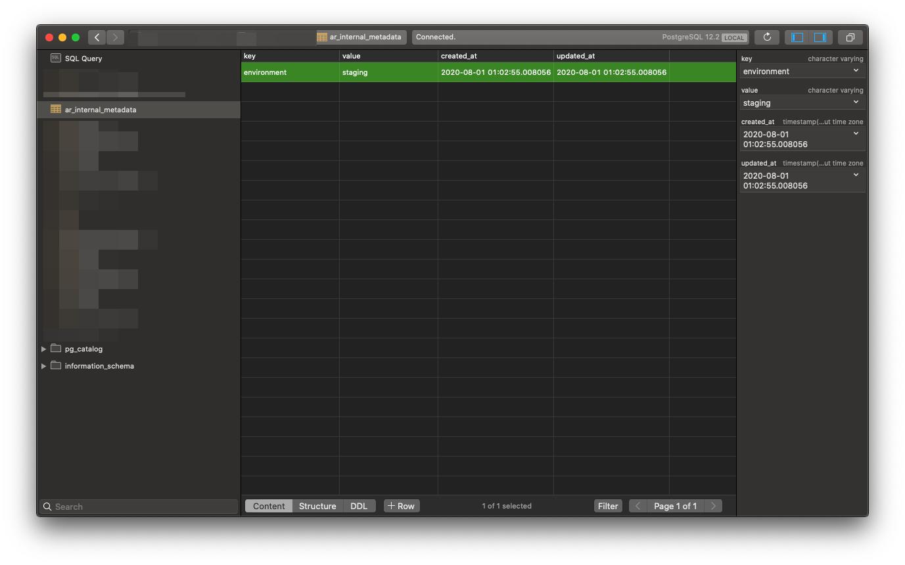

I've been "drinking my own champagne" on an app I'm hoping to release soon - a great practice if you want to really improve the experience for customers. In this process, I've created relevant data on production and needed to bring it in locally to work on a few edge cases I discovered.

In this article, I'm going to quickly walk you through how to do that using Heroku, PostgreSQL and Rails.

## Recreating the database

Ok, so first things first - you'll need to recreate your database.

In Rails, this is a two step process of dropping and then creating the database:

**Drop the database**

```bash
bundle exec rails db:drop
```

**Create the database**

```bash
bundle exec rails db:create
```

## Creating a backup

We'll need to create a "capture" of the database before importing:

```bash
 heroku pg:backups:capture --app my-app-name-on-heroku
```

Once the "capture" is done, we need to download it:

```bash
  heroku pg:backups:download --app my-app-name-on-heroku
```

⚠️ NOTE: This will download a `latest.dump` in the current directory that you're in. So make sure you're ignoring `.dump` files in your `.gitignore` so that you don't accidentally check it in.

## Importing your backup

Finally, we import it:

```bash
 pg_restore --verbose --clean --no-acl --no-owner -h DB_HOST -U postgres -d DATABASE_NAME latest.dump
```

Replace `DB_HOST` and `DATABASE_NAME` with the connection values you use to connect to the database.

## Changing the environment

In Rails, there is an `ar_internal_metadata` table that keeps track of settings used for [ActiveRecord](https://github.com/rails/rails/tree/master/activerecord), the ORM (Object-relational mapper) in Rails. We'll need to update the `environment` key to be `development` - otherwise you'll run into some weird issues.



## References

* [Importing and Exporting Heroku Postgres Databases](https://devcenter.heroku.com/articles/heroku-postgres-import-export)
    
* [pg\_restore](https://www.postgresql.org/docs/12/app-pgrestore.html)
    
* [Heroku PGBackups](https://devcenter.heroku.com/articles/heroku-postgres-backups)