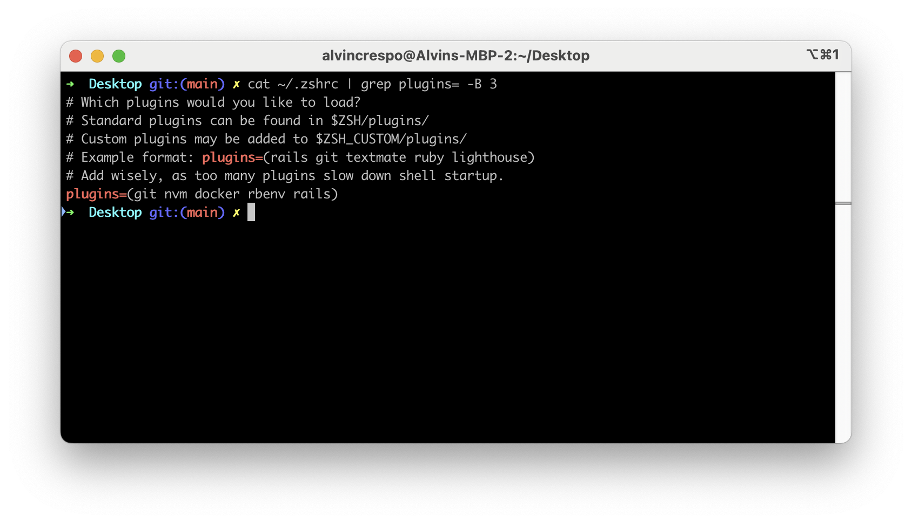

I use [ohmyzsh](https://ohmyz.sh/) as my preferred shell setup. I also use [Docker](https://www.docker.com/). Recently, I've been focused on automating the setup and teardown of my applications. This is where ohmyzsh's excellent support for docker comes in, as it has many aliases that help with shortening the use of common tasks:

%[https://github.com/ohmyzsh/ohmyzsh/tree/master/plugins/docker] 

You can add it to your `.zshrc` plugin list:

When you restart your shell, you'll have access to commands like

* `dipru` (`docker image prune -a`),
    
* `dps` (`docker ps`) and
    
* `dvls` (`docker volume ls`).
    

Additionally, if you enable stacking, you'll able to pass options to aliases like `dcls` (`docker container ls`). However, be aware of the following issue:

> This enables Zsh to understand commands like `docker run -it ubuntu`. However, by enabling this, this also makes Zsh complete `docker run -u<tab>` with `docker run -uapprox` which is not valid. The users have to put the space or the equal sign themselves before trying to complete.

Anyways, that's it for today! Ohmyzsh gives us many tools out of the box, docker aliases with autocompletion is one of them. Enable it and you'll have access to many commands you won't need to maintain yourself.

---

# References

[Ohmyzsh](https://ohmyz.sh/)

[Docker](https://www.docker.com/)

[ohmyzsh - docker reference](https://github.com/ohmyzsh/ohmyzsh/tree/master/plugins/docker)

[docker system prune](https://docs.docker.com/reference/cli/docker/system/prune/)

[docker image prune](https://docs.docker.com/reference/cli/docker/image/prune/)

[docker container ls](https://docs.docker.com/reference/cli/docker/container/ls/)

[docker volume ls](https://docs.docker.com/reference/cli/docker/volume/ls/)