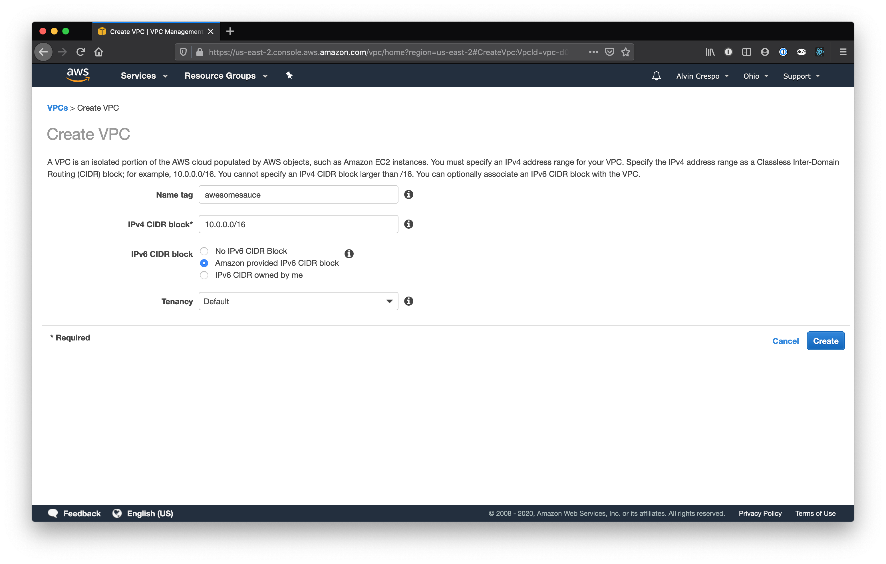
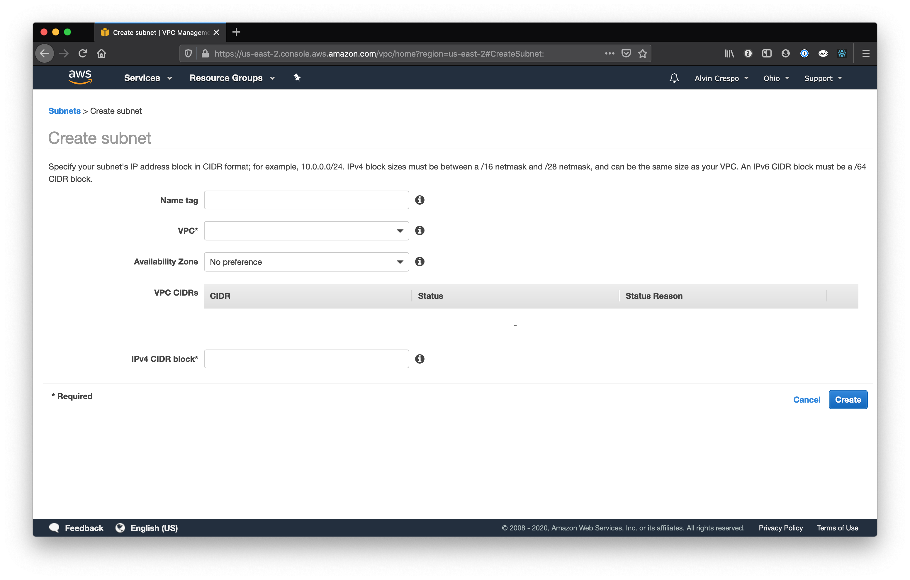
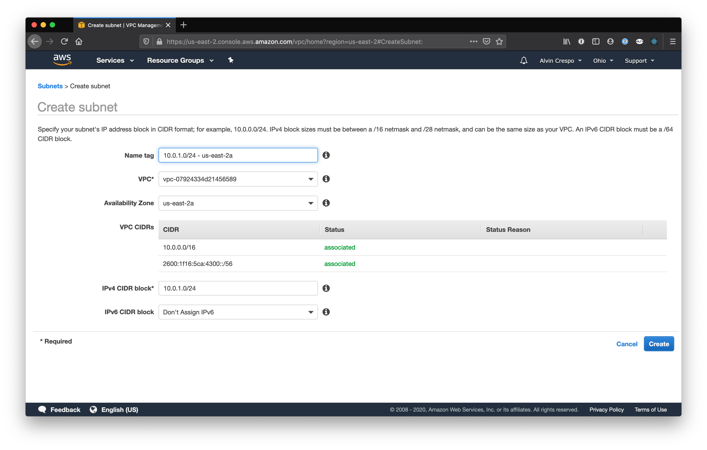
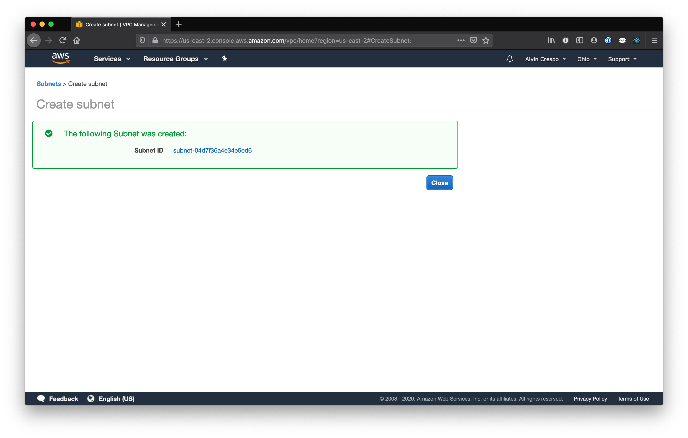
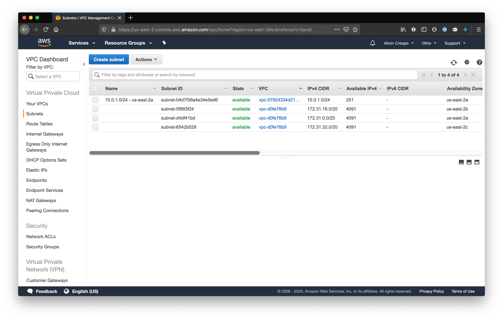
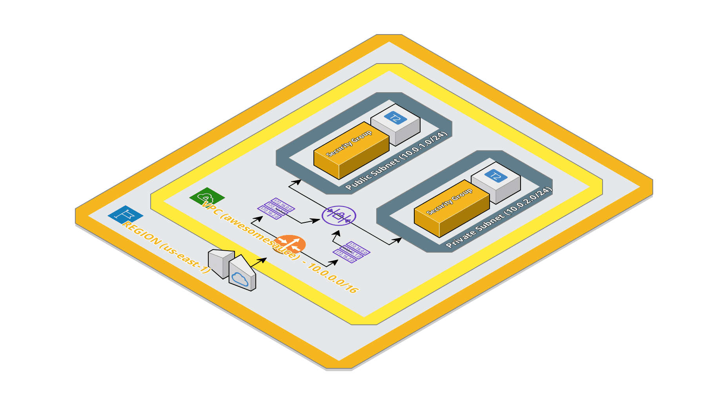

# Building a VPC from Scratch

# Create your VPC

Go to VPC

Click on "Your VPC's"

Click on "Create VPC"

Fill in the form. Specifying the proper CIDR block and selecting "Amazon Provided IPv6 CIDR block"

Click "Create"

---

# Create Subnet

## Create Public Subnet

Navigate to "Subnets"

Click "Create subnet"

You should now see the "Create subnet" workflow:

Fill In fields, like so:

Click "Create"

## Create Private Subnet

Click "Create subnet"

Click "Create"

## Enable Public IP on Public Subnet

Select the public subnet

Click Actions and select "modify auto-assign IP settings"

Select "Enable auto-assign public IPv4 address" and Click "Save"

You can now verify that the public subnet has an auto-assigned public IP address

---

# Create Internet Gateway

Navigate to "Internet Gateways"

Click "Create Internet gateway"

Give your new internet gateway a name

Your new internet gateway will be "detached"

Select your new "detached" internet gateway

Click "Actions" and select "Attach to VPC"

Attach the internet gateway to your new VPC

Click "Attach" and you should then see your new internet gateway attached to your VPC

---

# Configuring your Route Table

We need to configure our main route to go out to the internet.

Currently it is configured to have any subnet communicate with each other:

Both existing subnets have also been, by default, associated to main routing table:

Note: We do **NOT** want to open the main routing table to the internet. This would cause every subnet by default to be open to the internet.

Click "Create route table"

Give your new route table a name, and associate it with your new VPC

Click "Create"

Click "Close" and you should be taken to your route tables table:

Select your new route table and navigate to the "routes" tab:

You'll notice the new route table is not automatically configured to connect with the internet.

Click on "Edit routes"

Add both IPv4 and IPv6 routes and select the internet gateway that was created in the last section:

Note: 0.0.0.0/0 - IPv4 and ::/0 - IPv6

Click "Save routes" when done.

Click "Close". You should now be taken to your routes table.

Click on your new route table, and select "Routes" tab. You should see your new routes added:

However, neither of our subnets are associated with this public facing route table.

Select, "Subnet Associations"

You'll notice, no subnets are associated with this table.

Click "Edit subnet associations"

Select the subnet(s) you want to be public, for this article, we're selecting any device under 10.0.1.0/24 to be public.

Click "Save"

Now, when you select a route table and inspect it's associated subnets - you should see something like:

Note that 10.0.1.0/24 has been associated with our new public route table, while 10.0.2.0/24 stays in our private main routing table.

---

# Configuring EC2 Instances

## Configuring a Public EC2 Instance

Our public EC2 instance will be our webserver, this is where your Rails, Django, Express application would exist. It needs to be publicly accessible so we're going to attach it to our public subnet within our VPC. Let's get started!

Navigate to EC2

Click "Launch Instance" and select "Launch instance" from dropdown:

Select an AMI, for this article - we're going with the first option:

Select the instance type you prefer, again for this article we're keeping it simple so we're going with the free tier t2.micro instance type. Then click "Configure Instance Details".

These are the default settings you'll see:

You'll want to change the "Network" and "Subnet". The "Network" will be your **VPC** and your subnet will be your **public subnet**.

Note: The auto-assign Public IP is set to "Use subnet setting (Enable)".

Click "Next: Add Storage"

We're not changing anything here, click "Next: Add Tags"

Here, we're going to add a "Name" and set it to "awesomesauceWebServer" - you can name it whatever you like - I'm prefixing it with "awesomesauce" because thats the name of my VPC.

When you're done, click "Next: Configure Security Group"

Here, we'll create a new security group - I'm naming this one "awesomesauceDMZ". I'm also adding a rule for HTTP. To do this, click "Add Rule" and select "HTTP" from the dropdown.

When you're done, click "Review and Launch"

On this page, you can review all the settings for your public EC2 instance:

When, you're done verifying the settings - click "Launch".

The next step is creating or selecting an existing key pair. For this article, I'm going to create a new key pair and name it "awesomesauceKP".

Make sure to download this Key Pair and move it to a secure location. I store mine on 1password as secure file.

Finally, click "Launch Instance".

Your new instance will now start launching, click "View Instances"

When your new instance is done "launching" it will be in the instance state "running":

Awesome! Now it's time to create a private EC2 instance.

---

## Configuring a Private EC2 Instance

Click "Launch instance"

Select the AMI at the top, Amazon Linux 2 AMI

For the instance type, select t2.micro (free tier) and click "Next: Configure Instance Details"

These are the default settings you will see for your instance:

Let's configure this instance to use our VPC and the private subnet:

Note: The "Auto-assign Public IP" option will be set to "Use subnet setting (Disable)". It is disabled because we're putting it behind our private subnet.

Click "Next: Add Storage"

We'll leave our storage as is. Click "Next: Add Tags"

I'm going to give this instance a "Name" of "awesomesauceDBServer".

Click "Next: Configure Security Groups"

This private instance will keep the default security group.

Click "Review and Launch"

Review your instances setup here.

When done, click "Launch"

Before launching, you'll be asked again to "Select an existing key pair or create new key pair". Select "Choose an existing key pair" and select the created key pair from the last section called "awesomesauceKP".

Check the checkbox for acknowledging you have access to that key pair.

Click "Launch Instances"

You'll be taken to your instances status page, click "View Instances"

Your instance may be pending, but once it's finished launching - you should see:

Note: Your public instance, WebServer, will have an IPv4 Public IP - while your DBServer will not.

---

# Testing Your VPC

First, we need to `chmod` our new key pair:

    chmod 400 awesomesauceKP.pem

Next, we'll SSH into our public facing EC2 instance:

    ➜  SSH ssh ec2-user@13.59.155.220 -i awesomesauceKP.pem
    The authenticity of host '13.59.155.220 (13.59.155.220)' can't be established.
    ECDSA key fingerprint is SHA256:D9SKlqUSlqtZNPcYEF6+VtqMu0InXbY/KnwdXm5Zrgo.
    Are you sure you want to continue connecting (yes/no)? yes
    Warning: Permanently added '13.59.155.220' (ECDSA) to the list of known hosts.

           __|  __|_  )
           _|  (     /   Amazon Linux 2 AMI
          ___|\___|___|

    https://aws.amazon.com/amazon-linux-2/
    7 package(s) needed for security, out of 39 available
    Run "sudo yum update" to apply all updates.
    [ec2-user@ip-10-0-1-203 ~]$

Yay! We can connect to our public EC2 instance!

However, we can't ping our private instance:

    [ec2-user@ip-10-0-1-203 ~]$ ping 10.0.2.201 -w 2
    PING 10.0.2.201 (10.0.2.201) 56(84) bytes of data.

    --- 10.0.2.201 ping statistics ---
    2 packets transmitted, 0 received, 100% packet loss, time 1031ms

This is because we used our default security group when creating the private instance. We need to create a security group specific to our DB server and allow it to be accessed specifically by our subnet. Let's do it!

---

# Enabling Subnet → Subnet Communication

From the instances page, click on "Security Groups" in the left sidebar.

Click on "Creates Security Group".

In the "Create Security Group" modal - you'll want out enable a few inbound rules:

- HTTP
- HTTPS
- MySQL/Aurora
- SSH

Each rule should then have a "Custom" source set to our public subnet 10.0.1.0/24. This security group is essentially going to tell our DB server that they allowed inbound communication from our public facing subnet.

Click "Create" and you should see your new security group in the table, like so:

Now, click on "Instances" in the left sidebar.

From here, select the DB server, ours is "awesomesauceDBServer" and click "Actions". In the dropdown, hover over "Networking" and in the sub dropdown - click on "Change Security Group".

In the "Change Security Groups" mdoal, select the new security group we created and uncheck the default security group.

---

# Testing our VPC for Cross Subnet Communication

Alright! So now that our DB server has the newly configured security group to allow inbound communication from our public subnet - let's see if we can ping our DB server from inside our Web server:

    [ec2-user@ip-10-0-1-203 ~]$ ping 10.0.2.201 -w 2
    PING 10.0.2.201 (10.0.2.201) 56(84) bytes of data.

    --- 10.0.2.201 ping statistics ---
    2 packets transmitted, 0 received, 100% packet loss, time 1031ms

    [ec2-user@ip-10-0-1-203 ~]$ ping 10.0.2.201 -w 2
    PING 10.0.2.201 (10.0.2.201) 56(84) bytes of data.
    64 bytes from 10.0.2.201: icmp_seq=1 ttl=255 time=0.985 ms
    64 bytes from 10.0.2.201: icmp_seq=2 ttl=255 time=0.988 ms

    --- 10.0.2.201 ping statistics ---
    2 packets transmitted, 2 received, 0% packet loss, time 1001ms
    rtt min/avg/max/mdev = 0.985/0.986/0.988/0.031 ms
    [ec2-user@ip-10-0-1-203 ~]$

🎉🎉🎉 We now have cross communication between public and private subnets within our VPC.

---

# Summary: What we built

The diagram above shows what we have built.

- A VPC
  - Containing Two Subnets
    - One Public Subnet
      - An instance that can be accessed from the internet
    - One Private Subnet
      - An instance that cannot be accessed from the internet
  - Interfacing with an Internet Gateway
  - A main route table that does not have internet access
    - That has 10.0.2.0/24 subnet automatically attached to it since this subnet is not associated to any route table
  - A custom route table that does have internet access
    - That also has the 10.0.1.0/24 subnet associated with it
