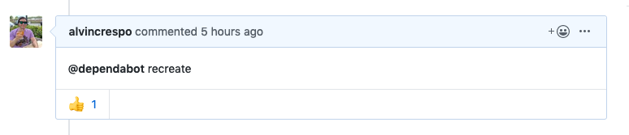

- How to fix bundler version issue when stuck on 1.17.2 or 1.17.3 but bundled app with 2.x series
  - https://github.com/coreinfrastructure/best-practices-badge/pull/1314#issue-308773660
- How to fix an issue installing postgresql-client on CircleCI when package repository is not updated in the container
  - https://discuss.circleci.com/t/random-404-when-doing-apt-get-install-postgresql-client/30286/4
    ```
    - run:
        name: Install PostgreSQL Cient
        command: sudo apt-get update && sudo apt install -y postgresql-client
    ```
- If you're using dependabot, and you manually rebase a PR the bot opened, you can have it auto rebase again by adding the comment:


