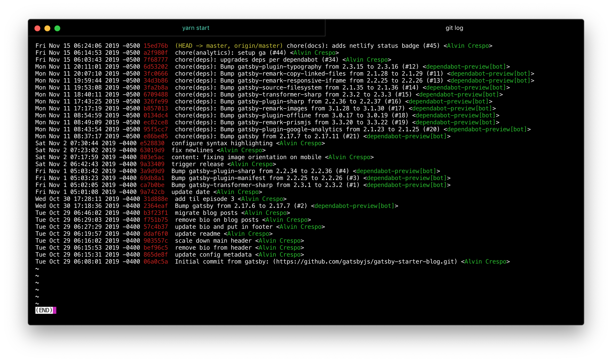
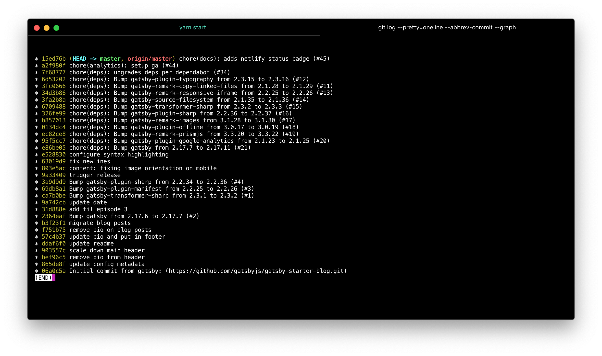

Ever wonder how you can easily check out your git timeline locally, without having to use a GUI or
have to go to Github? Yeah, there is an easy way.

You can configure your [global config](https://git-scm.com/book/en/v2/Customizing-Git-Git-Configuration) to this:

```
[format]
	pretty = %ad %Cred%h%Creset %C(yellow)%d%Creset %s <%Cgreen%an%Creset>
[log]
	decorate = short
```

I've been using this since my time at [Customer.io](https://customer.io/). Thanks to Stephen for showing me this!.

This will produce a timeline like:



For information around formatting, check out the `--format` flag [documentation](https://git-scm.com/docs/git-log#_pretty_formats).

<hr>

If you'd prefer to avoid creating a global configuration for viewing your timeline, you can easily
use `--oneline` and `--graph` flags in your terminal, thanks to [Chris Achard](https://twitter.com/chrisachard) for this one!

<blockquote class="twitter-tweet" data-theme="dark"><p lang="en" dir="ltr">Want to see something cool? <br><br>Open a terminal to an active git project you have, and type:<br><br>git log --oneline --graph<br><br>🤯</p>&mdash; Chris Achard (@chrisachard) <a href="https://twitter.com/chrisachard/status/1192825445265399811?ref_src=twsrc%5Etfw">November 8, 2019</a></blockquote>

So what does this command do?

```shell
git log --oneline --graph
```

Let's break it down:

Well, as per the [git documentation](https://git-scm.com/docs/git-log#Documentation/git-log.txt---oneline), `--oneline` is just a shortcut for `--pretty=oneline --abbrev-commit`:

```shell
git log --pretty=oneline --abbrev-commit --graph
```



Ok, so what does `--graph` do? The [git documentation](https://git-scm.com/docs/git-log#Documentation/git-log.txt---graph) states:

> Draw a text-based graphical representation of the commit history on the left hand side of the output.

So that's pretty much just giving you a nice way to represent your timeline with `*`.
